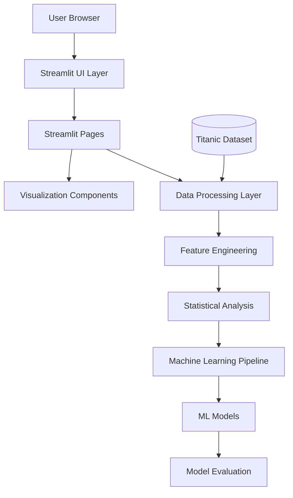
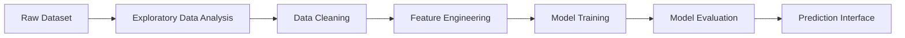

# Titanic Survival Prediction Dashboard

Interactive machine learning dashboard for analyzing and predicting passenger survival on the Titanic dataset.

Built with **Python, Streamlit, and Scikit-learn**, this project demonstrates a complete **end-to-end data science workflow**, from exploratory analysis to machine learning deployment.

---

# Table of Contents

* [Overview](#overview)
* [Live Demo](#live-demo)
* [Key Features](#key-features)
* [Architecture Overview](#architecture-overview)
* [System Architecture Diagram](#system-architecture-diagram)
* [Data Science Workflow](#data-science-workflow)
* [Technology Stack](#technology-stack)
* [Project Structure](#project-structure)
* [Installation](#installation)
* [Running the Application](#running-the-application)
* [Testing](#testing)
* [Documentation](#documentation)
* [Future Improvements](#future-improvements)
* [Dataset](#dataset)
* [Author](#author)
* [License](#license)

---

# Overview

This project implements a complete **data science and machine learning pipeline** through an interactive dashboard.

The application allows users to:

* explore the Titanic dataset
* analyze survival patterns
* perform statistical testing
* train and evaluate machine learning models
* generate survival predictions

The system is built with a **modular architecture** that separates:

* data processing
* machine learning logic
* visualization
* user interface

This structure allows the application to remain **maintainable, extensible, and production-ready**.

---

# Live Demo

Live Application
[https://titanic-streamlit-dashboard.onrender.com/](https://titanic-streamlit-dashboard.onrender.com/)

GitHub Repository
[https://github.com/FabriceGhislain7/titanic-streamlit-dashboard](https://github.com/FabriceGhislain7/titanic-streamlit-dashboard)

---

# Key Features

### Interactive Data Exploration

* dataset overview
* missing values analysis
* descriptive statistics
* interactive filtering

### Statistical Analysis

* correlation matrices
* hypothesis testing
* survival factor analysis
* categorical relationship exploration

### Feature Engineering

Advanced features including:

* passenger title extraction
* family size calculation
* fare normalization
* engineered predictive variables

### Machine Learning Pipeline

* automated preprocessing
* multiple model training
* cross-validation
* hyperparameter tuning
* model comparison

### Prediction Interface

* single passenger prediction
* batch prediction
* model evaluation visualization

---

# Architecture Overview

The application follows a **layered modular architecture**.

Main system layers include:

```
User Interface Layer
        |
        v
Application Logic Layer
        |
        v
Data Processing Layer
        |
        v
Machine Learning Layer
        |
        v
Data Layer
```

Each layer is designed to be **independent and reusable**, improving maintainability and scalability.

---

# System Architecture Diagram



---

# Data Science Workflow

The project follows a typical **data science workflow pipeline**.



---

# Technology Stack

## Application Framework

* Streamlit - interactive web applications
* Python 3.8+

## Data Science Libraries

* Pandas - data manipulation
* NumPy - numerical computing
* Scikit-learn - machine learning models
* SciPy - statistical analysis

## Visualization

* Plotly - interactive visualizations
* Matplotlib - static charts
* Seaborn - statistical plots

---

# Project Structure

```
titanic-streamlit-dashboard
|
|-- app.py
|
|-- src
|   |-- components
|   |-- data
|   |-- models
|   |-- utils
|   `-- config.py
|
|-- pages
|
|-- assets
|
|-- tests
|
|-- docs
|   |-- ARCHITECTURE.md
|   |-- ARCHITECTURE_WORKFLOW.md
|   `-- TECHNICAL_DOCUMENTATION.md
|
`-- requirements.txt
```

The architecture separates:

* UI components
* data processing
* machine learning logic
* utilities and configuration

---

# Installation

Clone the repository:

```bash
git clone https://github.com/FabriceGhislain7/titanic-streamlit-dashboard.git
cd titanic-streamlit-dashboard
```

Create a virtual environment:

```bash
python -m venv venv
```

Activate it:

Windows

```powershell
venv\Scripts\activate
```

Linux / Mac

```bash
source venv/bin/activate
```

Install dependencies:

```bash
pip install -r requirements.txt
```

---

# Running the Application

Run the Streamlit app:

```bash
streamlit run app.py
```

Open your browser:

```
http://localhost:8501
```

---

# Deploy on Render

This project can be deployed on **Render** as a Python web service.

The repository already includes a [`render.yaml`](render.yaml) blueprint with:

* Python runtime
* dependency installation from `requirements.txt`
* Streamlit startup command bound to Render's `$PORT`

## Option 1: Blueprint Deploy

1. Push the repository to GitHub.
2. In Render, click **New +** -> **Blueprint**.
3. Select this repository.
4. Confirm the service creation from `render.yaml`.
5. Wait for the first build to complete.

## Option 2: Manual Web Service

If you prefer creating the service manually on Render, use:

* **Environment**: `Python 3`
* **Build Command**:

```bash
pip install --upgrade pip && pip install -r requirements.txt
```

* **Start Command**:

```bash
streamlit run app.py --server.headless true --server.port $PORT --browser.serverAddress 0.0.0.0
```

## Notes

* `requirements.txt` includes the packages needed by the analytics and ML modules.
* No Streamlit Community Cloud configuration is required for Render.
* If you later add secrets, define them in the Render dashboard under **Environment Variables**.

---

# Testing

Run the test suite:

```bash
pytest
```

---

# Documentation

Detailed technical documentation is available in the **docs** directory.

* `docs/ARCHITECTURE.md` -> detailed system architecture
* `docs/ARCHITECTURE_WORKFLOW.md` -> architecture and workflow diagrams
* `docs/TECHNICAL_DOCUMENTATION.md` -> technical implementation details

---

# Future Improvements

Planned improvements include:

* database integration (PostgreSQL)
* REST API for predictions
* model monitoring
* model drift detection
* advanced ML models

---

# Dataset

The dataset used in this project is the Titanic dataset from:

Titanic Dataset

Used for educational and demonstration purposes.

---

# Author

Fabrice Ghislain Tebou

GitHub
[https://github.com/FabriceGhislain7](https://github.com/FabriceGhislain7)

---

# License

MIT License
