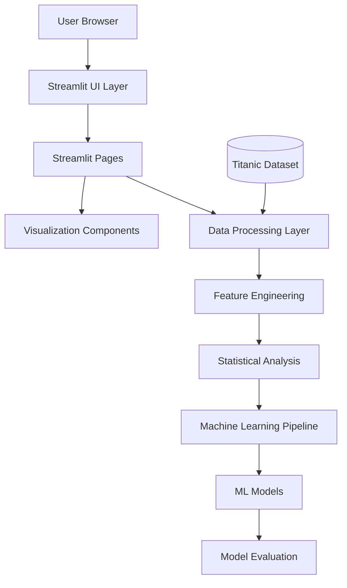
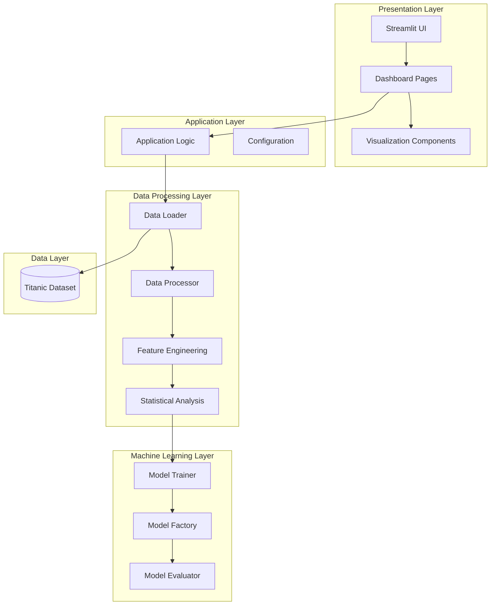
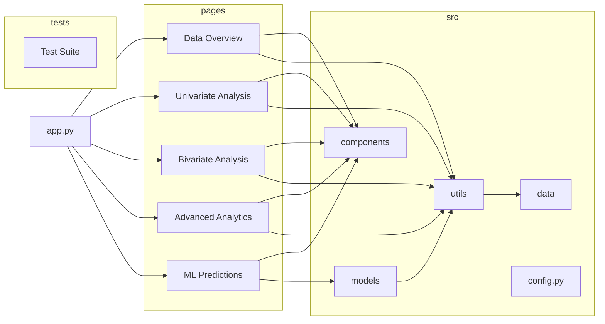
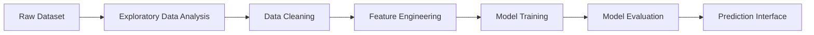

# System Architecture Diagram

---

# Layered Architecture Diagram

This diagram shows the **architectural layers**.

---

# Internal Module Architecture

This represents **the actual structure of the project**.

---

# Data Science Workflow Diagram

Questo è molto utile per **recruiter e data scientist**.

